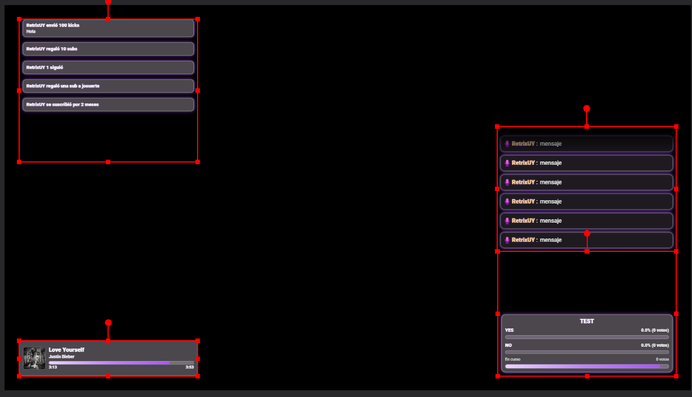

# StBot - Overlays y Alertas para Streaming

[](https://creativecommons.org/licenses/by-nc-sa/4.0/)

Este proyecto es un backend de Node.js diseñado para potenciar tus streams. Se conecta con **Streamer.bot**, **Spotify** y **Kick** para capturar eventos en tiempo real y mostrarlos en un conjunto de overlays web personalizables, listos para añadir a OBS o cualquier software de transmisión.



---

## ✨ Características

* **Integración con Streamer.bot**: Captura y procesa eventos de Kick en tiempo real.
* **Alertas personalizables**: Notificaciones visuales para follows, raids, suscripciones, regalos de subs y Kicks.
* **Chat en Overlay**: Muestra el chat de Kick directamente en tu stream con un diseño moderno.
* **Integración con Spotify**:
    * Muestra la canción que está sonando con carátula, artista y barra de progreso.
    * Sistema de **Song Request** canjeable a través de recompensas de canal.
* **Overlays de Encuestas y Predicciones**: Visualiza en tiempo real las encuestas y predicciones de Streamer.bot.
* **Backend Robusto**: Construido con TypeScript, moderno y con reconexión automática a los servicios.
* **Fácil de Configurar**: Todo se gestiona a través de un simple archivo de entorno.

---

## 🚀 Instalación y Configuración

Sigue estos pasos para poner en marcha el proyecto.

### 1. Prerrequisitos

* **Node.js**: v18 o superior.
* **Streamer.bot**: Con la extensión de Kick configurada.
* **Cuenta de Desarrollador de Spotify**: Necesitarás crear una aplicación en el [Dashboard de Desarrolladores de Spotify](https://developer.spotify.com/dashboard) para obtener tus credenciales.

### 2. Instalación

1.  **Clona el repositorio**.
2.  **Abre una terminal** en la carpeta del proyecto.
3.  **Instala las dependencias**:
    ```bash
    npm install
    ```

### 3. Acciones de Streamer.bot

Este proyecto necesita un conjunto de acciones para funcionar. Las encontrarás en el archivo `Actions.txt`.

1.  **Importa las Acciones**: En Streamer.bot, ve a la pestaña `Actions`. En el panel superior, haz clic derecho y selecciona `Import`. Busca y selecciona el archivo `Actions.txt` de este proyecto.
2.  **Copia los IDs**: Una vez importadas, se crearán 4 nuevas acciones. Haz clic derecho sobre cada una de ellas, selecciona **`Copy Action ID`** y pega el ID en el archivo `.env` que crearás en el siguiente paso.

### 4. Configuración del Entorno

1.  Crea un archivo llamado `.env` en la raíz del proyecto.
2.  Copia y pega el siguiente contenido, rellenando los valores con tus credenciales y los IDs de las acciones que acabas de importar.

    ```env
    # PUERTO DEL SERVIDOR LOCAL
    PORT=4000

    # -- STREAMER.BOT --
    SB_HOST=127.0.0.1
    SB_PORT=8080
    SB_PASSWORD=

    # -- SPOTIFY --
    SPOTIFY_CLIENT_ID=TU_CLIENT_ID_DE_SPOTIFY
    SPOTIFY_CLIENT_SECRET=TU_CLIENT_SECRET_DE_SPOTIFY
    SPOTIFY_REDIRECT_URI=http://localhost:4000/callback

    # ID de la recompensa de canal para el Song Request
    REDEMPTION_ID=ID_DE_LA_RECOMPENSA_DE_STREAMERBOT

    # IDs de las Acciones importadas de Streamer.bot
    ACTION_GET_REDEEMS=ID_DE_LA_ACCION_PARA_OBTENER_RECOMPENSAS
    ACTION_SEND_MESSAGE=ID_DE_LA_ACCION_PARA_ENVIAR_MENSAJE_AL_CHAT
    ACTION_REJECT_REDEMPTION=ID_DE_LA_ACCION_PARA_RECHAZAR_RECOMPENSA
    ACTION_ACEPT_REDEMPTION=ID_DE_LA_ACCION_PARA_ACEPTAR_RECOMPENSA
    ```

### 5. Autorización de Spotify (Solo una vez)

1.  Inicia el proyecto.
2.  Abre tu navegador y ve a `http://localhost:4000/auth`.
3.  Inicia sesión y autoriza la aplicación.

---

## 🏃‍♂️ Ejecutar la Aplicación

* **Modo Desarrollo**:
    ```bash
    npm run dev
    ```

* **Modo Producción**:
    ```bash
    npm run build
    npm start
    ```

---

## 🖥️ Añadir Overlays a OBS

Crea una nueva **Fuente de Navegador** (Browser Source) para cada uno con las siguientes URLs:

* **Alertas**: `http://localhost:4000/overlay/alerts.html`
* **Chat**: `http://localhost:4000/overlay/chat.html`
* **Now Playing (Spotify)**: `http://localhost:4000/overlay/nowplaying.html`
* **Encuestas / Predicciones**: `http://localhost:4000/overlay/polls.html`

---

## ⚖️ Licencia

Este proyecto está bajo la licencia **Creative Commons Attribution-NonCommercial-ShareAlike 4.0 International**.

[](https://creativecommons.org/licenses/by-nc-sa/4.0/)